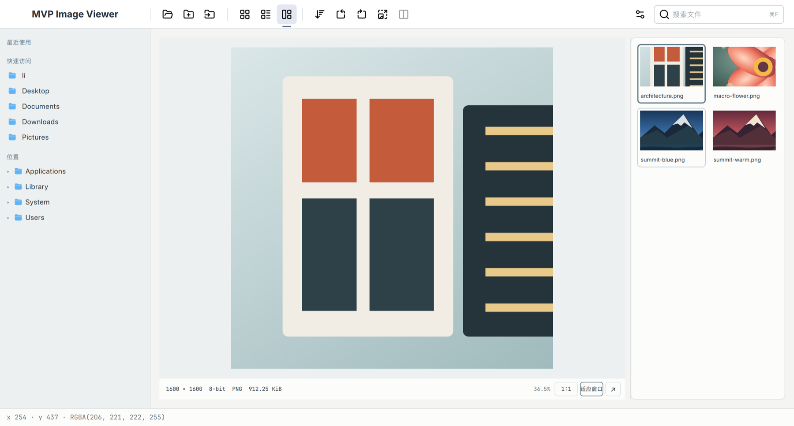
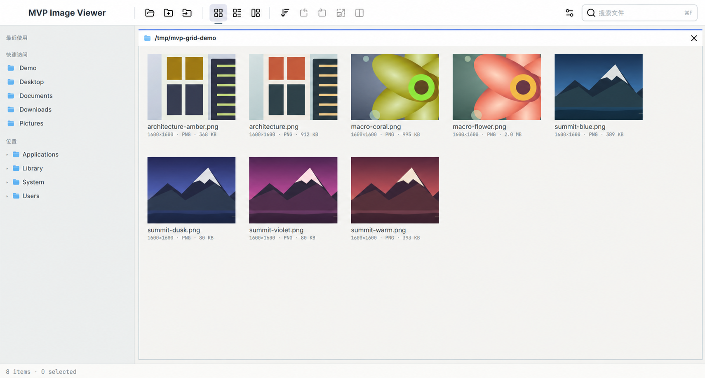
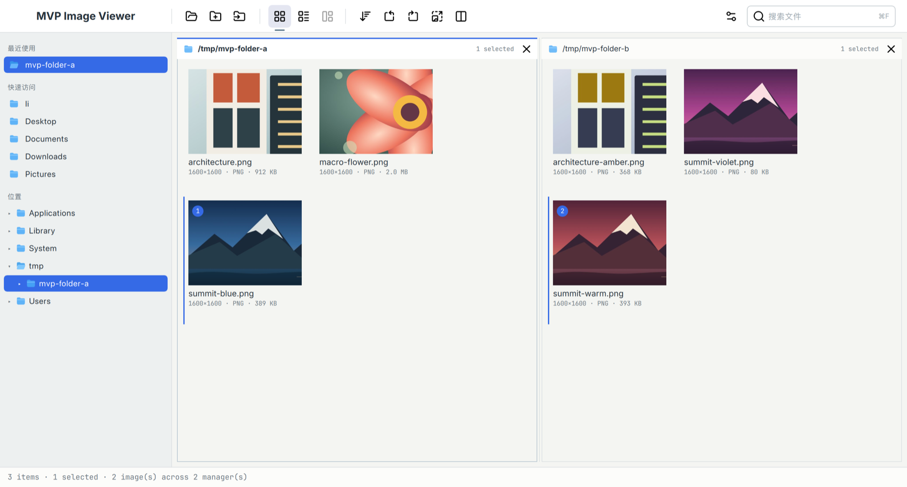
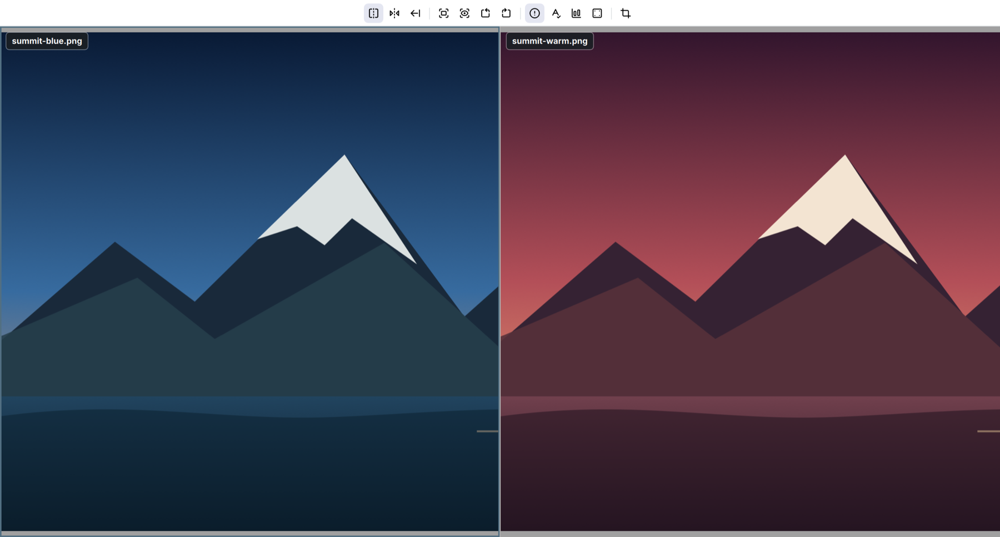

<p align="center">
  
</p>

<h1 align="center">MVP Image Viewer</h1>

<p align="center">
  <strong>Browse, inspect, compare—nothing in the way.</strong><br>
  <em>Maybe the MVP is all you need.</em>
</p>

<p align="center">
  
  
  
  
</p>

<p align="center">
  English · <a href="README.md">简体中文</a>
  <br>
  <a href="../../releases">Download</a> ·
  <a href="#core-capabilities">Core capabilities</a> ·
  <a href="#supported-formats">Formats</a> ·
  <a href="#building">Build from source</a>
</p>

MVP Image Viewer is a lightweight cross-platform desktop application built with Qt 6. It keeps the high-frequency tools that matter to photographers, designers, imaging engineers, and ISP developers: fast browsing, precise pixel inspection, and synchronized comparison of two to four images.

The product is intentionally focused. Complexity is added only when it directly improves the image-inspection workflow.

The project is currently in release-candidate stabilization. Default packages include JPEG, PNG, and camera RAW browsing and comparison; headerless RAW/YUV remains an advanced feature.

## Screenshots

### Gallery view and inspection

Keep the directory tree, thumbnails, and a large image preview in one workspace. Select an image to zoom, pan, and inspect its pixels immediately.



### Grid thumbnail browsing

Scan an entire folder through clear image cards with filenames, dimensions, formats, and file sizes visible at a glance.



### Browse and select across folders

Open one to four independent file managers in the same window, select images from different folders, and send them directly into one comparison session.



### Compare in sync

Synchronize zoom and pan across two to four images, or use split inspection and hold-B-over-A comparison to spot differences in composition, color, and detail.



> The images shown in these screenshots are generated, copyright-safe demo fixtures and are not bundled with the application.

## Core capabilities

| Workflow | Capabilities |
|---|---|
| Browse | Finder/Explorer-style directory tree, history, search, sorting, thumbnails, and multi-folder workspaces |
| Inspect | Fit, 100%, cursor-centered zoom, pan, coordinates, RGB values, file details, EXIF, and luma histograms |
| Compare | Synchronized two-to-four-image zoom/pan, horizontal or vertical split, hold-B-over-A, and per-pane details |
| Manage files | Copy, cut, paste, rename, drag and drop, reveal in file manager, and system Trash integration |
| Extended formats | Optional RAW/YUV interpretation, camera RAW, metadata extraction, and ICC conversion into the display colour space |

### Experience highlights

- Finder/Explorer-style directory tree, history navigation, search, sorting, and thumbnail browsing
- Asynchronous directory scanning, image decoding, and persistent thumbnail caching
- GPU-backed image canvas built on Qt RHI
- Fit, 100%, cursor-centered zoom, pan, coordinates, and pixel inspection: no alpha channel; YUV reports the source YUV triple together with the converted RGB; with demosaicing off, RAW shows the source mosaic in CFA false colour (each sample feeds only its R, G, or B filter channel and brightness is mapped linearly against the RAW bit-depth maximum) and reports pixel values as RAW-depth RGB; with demosaicing on it reports the developed RAW-depth RGB; 16-bit data keeps its source depth; camera RAW (LibRaw) decodes at 16-bit, retains the sensor mosaic, and applies the demosaic switch to both the image and the pixel values; RAW/YUV previews are promoted to the full decode before source samples are reported; the hovered coordinate stays aligned with the image at high magnification
- Full-screen browsing and synchronized zoom/pan comparison for two to four images
- Horizontal or vertical split inspection for two images, plus hold-B-over-A comparison
- Per-pane file information, EXIF data, luma histogram, and pixel overlays
- One-to-four-pane multi-folder workspace with cross-directory selection
- Copy, cut, paste, rename, drag and drop, file-manager reveal, and system Trash integration
- Settings for language, light/dark appearance, custom shortcuts, daily update checks, and an in-app guide
- Optional RAW/YUV interpretation, source-plane pixel inspection, histograms, and ROI statistics
- Optional camera RAW, EXIF/IPTC/XMP metadata, and ICC conversion; the display colour space follows the display by default (or can be pinned to sRGB, Display P3, Adobe RGB (1998), or BT.2020), with ICC destinations, panel readouts, and decode caches following it

## Download and run

Prebuilt packages are published through [GitHub Releases](../../releases).

- macOS (Apple Silicon): download the `.dmg`, open it, and drag the app to Applications
- Windows (x64): download `-setup.exe` and follow the installer; uninstall it from Installed apps

Launch the application normally, or pass an initial directory on the command line:

```sh
MVPImageViewer /path/to/images
```

Current macOS installers may not be Apple-notarized, and Windows installers may not yet be code-signed. The operating system may show a security warning on first launch; on macOS, Control-click the application in Finder and choose **Open**.

The app checks GitHub Releases at most once every 24 hours when automatic checks are enabled. When a newer version is available, Settings → Updates can download the installer for the current platform. The app verifies it against the installer asset's SHA-256 digest from the GitHub Release API before enabling installation. Downloads and installation always require an explicit user action, and an in-progress download can be cancelled.

## Supported formats

| Type | Support | Notes |
|---|---|---|
| JPEG / JPG | Built in | Browsing, thumbnails, full screen, and comparison |
| PNG | Built in | Browsing, thumbnails, full screen, and comparison with Alpha preserved |
| BMP / DIB | Built in | Standard Windows Bitmap; `.dib` uses the BMP decoder |
| HEIC / HEIF | System-dependent | Enabled when the current Qt/OS HEIF plugin is available; reads the primary image without sequence playback |
| NV12 / NV21 / I420 / P010 | Built-in advanced feature | Headerless data; matrix, primaries, transfer, range, and chroma location are interpreted and converted into the sRGB display buffer |
| Bayer RAW10 / RAW12 / RAW16 | Built-in advanced feature | Standard 2×2 Bayer and 4×4 Quad Bayer, CFA, valid bits, byte order, black/white levels, white balance, CCM, and gamma parameters |
| DNG / camera RAW | Built in | Packages include LibRaw 0.21+; decoded at 16-bit with the sensor mosaic retained; full images use the app's white-balance, CCM, and gamma parameters |
| EXIF / IPTC / XMP | Built in | Packages include Exiv2 0.28+ |
| Embedded RGB ICC | Optional | Requires LittleCMS 2.x; 8-bit, 16-bit, and floating-point RGB are converted into the display interchange space |

The display interchange space offers four encodings: **sRGB, Display P3, Adobe RGB (1998), and BT.2020**, plus **Auto (follow display)**, which is the default: it reads the colour space the platform reports for the window surface and picks the matching encoding, falling back to sRGB when it cannot be recognised. Switch it at any time under Settings → Color & display; the card shows the space that is actually in effect. The selected space decides how YUV and Bayer frames are encoded for the canvas, the destination of embedded ICC conversion, the colour space tagged on decoded frames, and the colour readouts of the histogram and pixel probe. Decode caches are invalidated per space, so frames from different spaces are never mixed.

Auto is the default because the compositor interprets the canvas buffer in the colour space the platform tags the window surface with, and that space follows the display configuration (Display P3 on a P3 panel, for example). Following it keeps on-screen colours consistent with the colour-managed reference; pinning sRGB or another space instead makes the presented result drift on a display that does not match it (see the limitations below).

The app does not write the developed display buffer back as the source file. Rotate and resize preserve the source colour space when the format can embed it; formats such as BMP/DIB that cannot reliably retain arbitrary ICC profiles are converted to sRGB first. The demosaiced Bayer view (the CCM and display gamma of the RAW parameters) is a user-defined transform: its primaries stay sRGB/BT.709 with the requested power gamma, independent of the display space, and the properties panel states exactly that.

TIFF, WebP, OpenEXR, AVIF, JPEG XL, PSD, SVG, PDF, and GIF are currently outside the supported scope. Actual HEIC/HEIF availability depends on the runtime; files are hidden from the gallery when the corresponding Qt image plugin is unavailable.

## Requirements

- CMake 3.25+
- A C++20 compiler
- Qt 6.9+ with Core, Gui, Quick, Quick Controls 2, Quick Layouts, Svg, ShaderTools, LinguistTools, and private Gui headers
- macOS: Apple Silicon; Qt 6.9.x is the currently validated version
- Windows: x64; MSYS2/UCRT64 with GCC and Ninja is recommended

Required dependencies:

- LibRaw 0.21+
- Exiv2 0.28+

Optional dependency:

- LittleCMS 2.x

## Building

### macOS

Install the image libraries first: `brew install libraw exiv2 pkgconf`.

Use the project wrapper:

```sh
./build_macos.sh dev --test
./build_macos.sh release
./build_macos.sh package
```

- `dev` creates a Debug application under `build/`
- `release` creates a Release application under `build/`
- `package` deploys runtime dependencies and writes an installable DMG to `dist/`; it also creates a portable ZIP by default, which `--no-zip` disables. Packaging prunes unused Qt styles, QML modules, and plug-ins through a whitelist, then verifies that runtime dependencies are bundle-local

Equivalent CMake Preset commands:

```sh
cmake --preset macos-debug -DCMAKE_PREFIX_PATH="$(brew --prefix)"
cmake --build --preset macos-debug
ctest --preset macos-debug --output-on-failure
```

Run `./build_macos.sh --help` for cleanup, signing, RHI validation, and parallel-build options.

For a smaller package, build the validated Qt 6.9 No-ICU variant:

```sh
./scripts/build_qt_no_icu_macos.sh -j 8
./build_macos.sh debug --qt-prefix build/qt-no-icu/install --test
./build_macos.sh package --qt-prefix build/qt-no-icu/install
```

This variant retains QML, SVG, international file names, and native natural sorting while
removing the packaged ICU libraries. The initial Qt build is long; later runs reuse
`build/qt-no-icu`. This custom Qt toolchain has currently been build-, test-, and
package-validated on macOS arm64 only. Windows continues to use the regular Qt build and
cannot reuse the macOS artifacts.

### Windows

The recommended toolchain is MSYS2/UCRT64:

Install the build and packaging dependencies in UCRT64 first:

```bash
pacman -S --needed mingw-w64-ucrt-x86_64-libraw mingw-w64-ucrt-x86_64-exiv2 mingw-w64-ucrt-x86_64-nsis
```

```powershell
$env:MSYS2_UCRT64 = (& qmake -query QT_INSTALL_PREFIX).Trim()
.\build_windows.ps1 -Toolchain msys2 -Mode dev -Test
.\build_windows.ps1 -Toolchain msys2 -Mode release
.\build_windows.ps1 -Toolchain msys2 -Mode package
```

`package` uses NSIS 3.x to create `MVPImageViewer-<version>-windows-x64-setup.exe` in `dist/`. It installs for the current user, creates Start menu shortcuts, and registers a standard uninstaller. A portable ZIP is also created by default; pass `-NoZip` to create only the installer.

Windows package mode uses the same Qt runtime pruning policy as macOS. Platform-specific components remain separate: `qwindows` is retained on Windows and `qcocoa` on macOS.

Equivalent CMake Preset commands:

```powershell
cmake --preset windows-msys2-debug
cmake --build --preset windows-msys2-debug
ctest --preset windows-msys2-debug --output-on-failure
```

The wrapper also retains `-Toolchain msvc` as an optional Visual Studio path.

## Dependencies

LibRaw and Exiv2 are required; CMake configuration fails if either is missing. LittleCMS remains optional:

```sh
cmake --preset macos-debug \
  -DISPVIEW_ENABLE_LCMS2=OFF
```

The vcpkg manifest installs LibRaw and Exiv2 by default. Its optional feature is:

- `color-management`

GitHub Release packages include LibRaw, Exiv2, and their runtime dependencies in both the macOS DMG and Windows installer.

> **License note:** Exiv2 is licensed under GPL-2.0-or-later. Before distributing, make sure the combined application's distribution complies with it, including applicable source-delivery requirements. Qt, LibRaw, LittleCMS, and transitive packaged dependencies retain their respective licenses as well.

## Tests and benchmarks

Debug presets build the automated test suite:

```sh
ctest --preset macos-debug --output-on-failure
```

Release presets can build RAW decoding, histogram, color-management, and large-directory benchmarks:

```sh
cmake --build --preset macos-release
./build/macos-preset-release/tools/ispview_raw_benchmark --48mp
./build/macos-preset-release/tools/ispview_histogram_benchmark --48mp
./build/macos-preset-release/tools/ispview_color_benchmark --48mp
./build/macos-preset-release/tools/ispview_browser_benchmark --enforce
```

Real-world image fixtures should remain local. Do not commit media containing personal information, precise locations, or unclear ownership.

## Project layout

```text
src/core       Core types, caches, histograms, and synchronized state
src/io         Decoders, metadata, color management, and file operations
src/render     RHI rendering parameters and shaders
src/browser    Directory, thumbnail, drag-and-drop, and clipboard models
src/platform   macOS/Windows platform services and shortcuts
src/qml        Application entry point, controllers, and QML UI
tests          C++ and QML automated tests
tools          Benchmarks and diagnostic tools
```

## License

Original project code and assets are licensed under the [MIT License](LICENSE), permitting use, modification, and redistribution, including commercial use, provided the copyright and permission notices are retained.

Third-party components retain their own licenses and are not covered by the project's MIT license. See [third-party notices](THIRD_PARTY_NOTICES.md) and the [complete icon license](licenses/Lucide-LICENSE) for the Lucide and Feather-derived icon attributions and file inventory. The application uses system fonts and does not bundle third-party font files.

Packaging scripts include the project license and icon notices. These do not replace the notices and source delivery required by Qt, Exiv2, LibRaw, LittleCMS, and their transitive dependencies. Builds with Exiv2 enabled still require a combined distribution compatible with GPL-2.0-or-later.

Packaging also requires Python 3.9+ and inventories deployed runtime files, collecting license notices and available SBOMs. Unverified provenance or missing notices blocks installer creation. MSYS2 matching is automatic; other SDKs/custom builds require a reviewed provenance catalog. See [runtime license collection](packaging/RUNTIME_LICENSES.md) for configuration and scope.

## Logging and crash diagnostics

[Diagnostic settings, export, symbols and validation](docs/diagnostics.md)

macOS builds can pass `-DISPVIEW_ENABLE_CRASHPAD=OFF` to skip Crashpad; the settings page then reports crash capture as unavailable while logging, cleanup and export keep working.
